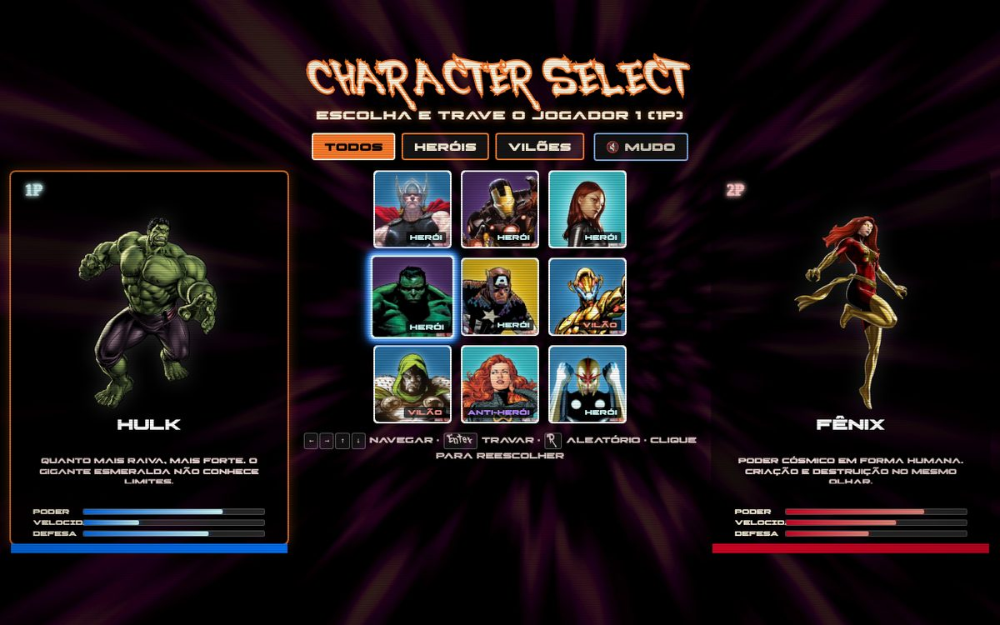
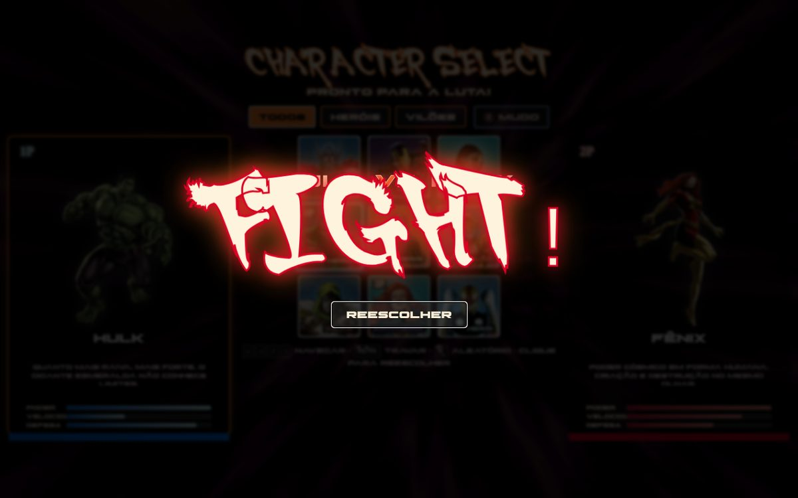

# Character Select VS Mode — MapaDev Week

[](https://developer.mozilla.org/docs/Web/HTML)
[](https://developer.mozilla.org/docs/Web/CSS)
[](https://developer.mozilla.org/docs/Web/JavaScript)
[](LICENSE)

Tela de **seleção de personagens em modo VS** estilo arcade, evoluída a partir do projeto do **MapaDev Week** — HTML, CSS e JavaScript puro (sem frameworks, sem CDN).

> Trave o 1P, depois o 2P, e prepare-se para o **FIGHT!**  
> Funciona abrindo o `index.html` via `file://` ou pelo GitHub Pages.

## Resultado





**Demo:** [denispaulo.github.io/projeto-mapadev-week](https://denispaulo.github.io/projeto-mapadev-week/)

## Como abrir

1. **Demo online:** [denispaulo.github.io/projeto-mapadev-week](https://denispaulo.github.io/projeto-mapadev-week/)
2. **No PC:** abra o `index.html` no navegador (duplo clique — funciona via `file://`)

Servidor local é opcional (útil se o navegador restringir algo):

```bash
# opcional — se tiver Python no PATH
python -m http.server 5500
```

## O que tem nesta versão

- **Modo VS** — hover pré-visualiza o slot ativo; clique (ou Enter) trava 1P e depois 2P; tags `1P`/`2P`; clique no retrato grande para reescolher
- **FIGHT!** — overlay dramático quando ambos estão travados (Reescolher / Esc / Enter)
- **Filtros** — chips Todos / Heróis / Vilões (+ tag Anti-herói na Fênix)
- **Atributos** — barras fictícias de Poder, Velocidade e Defesa
- **Teclado** — setas para focar, Enter para travar, `R` para aleatório, `1`/`2` para reabrir o slot
- **Visual CRT** — scanlines, brilho nos selecionados (mais suave no mobile)
- **Som** — beeps via Web Audio API; **mudo por padrão**; botão na UI
- **URL compartilhável** — `?p1=hulk&p2=fenix` (atualiza com `replaceState` ao travar)
- **localStorage** — lembra o último VS e o mute (prioridade: URL → localStorage → Hulk vs Fênix)

### Elenco

| ID | Nome | Alinhamento |
| --- | --- | --- |
| `thor` | Thor | Herói |
| `homem-de-ferro` | Homem de Ferro | Herói |
| `viuva-negra` | Viúva Negra | Herói |
| `hulk` | Hulk | Herói |
| `capitao-america` | Capitão América | Herói |
| `ultron` | Ultron | Vilão |
| `doutor-doom` | Doutor Doom | Vilão |
| `fenix` | Fênix | Anti-herói (filtro Heróis) |
| `nova` | Nova | Herói |

Exemplo de link:  
`https://denispaulo.github.io/projeto-mapadev-week/?p1=thor&p2=ultron`

## Controles

| Ação | Mouse / toque | Teclado |
| --- | --- | --- |
| Pré-visualizar | Hover / foco | Setas |
| Travar slot ativo | Clique no retrato | `Enter` |
| Aleatório no slot | — | `R` |
| Reescolher 1P / 2P | Clique no painel grande | `1` / `2` |
| Fechar FIGHT! | Botão ou fundo | `Esc` / `Enter` / Espaço |
| Som | Botão Mudo / Som | — |

## Estrutura

```
projeto-mapadev-week/
├── index.html
├── docs/                 # previews do README
└── src/
    ├── css/              # variáveis, reset, estilos, animações, responsivo, fontes
    ├── js/               # lógica VS (lock, filtro, teclado, som, URL, storage)
    ├── imagens/          # artes .jpg / .png dos personagens (reutilizadas)
    └── fontes/           # tipografia do layout
```

## Aprendizados

- Estado de seleção em dois slots (preview vs lock)
- DOM dinâmico + acessibilidade básica (`aria-*`, `role`)
- Web Audio sem autoplay agressivo
- Persistência com `localStorage` e deep-link via query string
- CSS com variáveis, animações e media queries (incluindo `prefers-reduced-motion`)

## Licença

Distribuído sob a licença [MIT](LICENSE).

---

Feito por [Denis Paulo](https://github.com/DenisPaulo) · projeto do MapaDev Week
